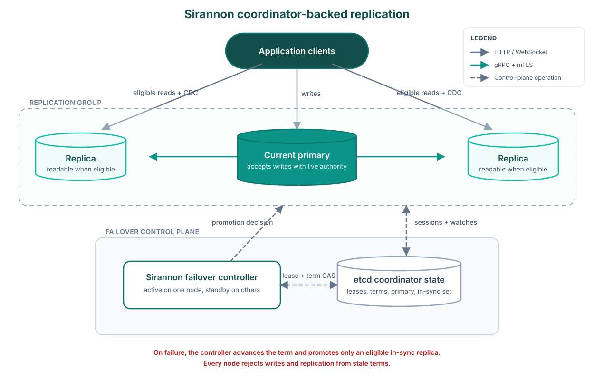

# Distributed replication

<p align="center">
  
</p>

One primary accepts writes and pushes changes to read replicas, which serve reads and forward writes when `writeForwarding` is on. Each node has its own SQLite file; Sirannon moves checksummed batches of changes over the replication transport and never shares one file over a network filesystem.

```ts
import { PrimaryReplicaTopology, ReplicationEngine } from '@delali/sirannon-db/replication'
import { GrpcReplicationTransport } from '@delali/sirannon-db/transport/grpc'

const transport = new GrpcReplicationTransport({
  host: '0.0.0.0',
  port: 4200,
  tlsCert: './certs/primary.crt',
  tlsKey: './certs/primary.key',
  tlsCaCert: './certs/ca.crt',
})

const engine = new ReplicationEngine(db, writerConn, {
  nodeId: 'primary-us-east-1',
  topology: new PrimaryReplicaTopology('primary'),
  transport,
  snapshotConnectionFactory: () => driver.open(dbPath, { readonly: true }),
  changeTracker: tracker,
})

await engine.start()
```

A replica points at the primary's endpoints:

```ts
const replicaEngine = new ReplicationEngine(replicaDb, replicaConn, {
  nodeId: 'replica-eu-west-1',
  topology: new PrimaryReplicaTopology('replica'),
  transport: replicaTransport,
  transportConfig: { endpoints: ['primary.example.com:4200'] },
  writeForwarding: true,
  changeTracker: replicaTracker,
})

await replicaEngine.start()
```

With `initialSync` on (the default), a new node pulls a full snapshot before it serves reads: the source streams schema and table data in batches with per-batch checksums, then a manifest, and the joiner moves through `pending` -> `syncing` -> `catching-up` -> `ready`, which you read from `engine.status().syncState`. For a database too large to transfer, copy the file and start from a known sequence with `initialSync: false` and `resumeFromSeq`.

Write concerns control how many replicas must acknowledge a write:

```ts
await engine.execute('INSERT INTO orders (id, total) VALUES (?, ?)', [1, 4999], {
  writeConcern: { level: 'majority', timeoutMs: 5000 },
})
```

Static mode returns after the local commit when you omit `writeConcern`; coordinator mode selects `'majority'`. Coordinator-mode majority counts the configured voting nodes, including the primary's own durable commit, so such a write survives automatic failover when only the failed primary is lost.

## Read concern

A read concern states how current a read must be. Coordinator mode enforces it and static mode ignores it.

| Level | What the node must prove |
| --- | --- |
| `local` | Nothing. The read returns local state, which failover may later quarantine. |
| `majority` | The node is in the in-sync set and is neither draining nor repairing. |
| `linearizable` | The read runs on the current primary, after it proves live authority for its term. |

A read concern that cannot be met fails with `READ_CONCERN_ERROR` rather than returning a weaker result.

```ts
const rows = await engine.query('SELECT id, total FROM orders WHERE id = ?', [42], {
  readConcern: { level: 'linearizable' },
})
```

`GET /db/{id}/cluster` lists the levels each node currently serves, which is how the [topology-aware client](client.md#topology-aware-routing) picks an endpoint for a read.

## Coordinator-backed failover

Coordinator mode stores primary authority, node sessions, group state, and the in-sync set in a `ClusterCoordinator`. The package includes an etcd adapter:

```ts
import { createEtcdCoordinator } from '@delali/sirannon-db/replication/coordinator/etcd'

const coordinator = createEtcdCoordinator({
  hosts: ['https://etcd-1.internal:2379', 'https://etcd-2.internal:2379'],
  keyPrefix: '/sirannon/orders',
  credentials: {
    rootCertificate: readFileSync('./certs/etcd-ca.crt'),
    privateKey: readFileSync('./certs/orders-node.key'),
    certChain: readFileSync('./certs/orders-node.crt'),
  },
})

const engine = new ReplicationEngine(db, writerConn, {
  nodeId: 'orders-node-a',
  topology: new PrimaryReplicaTopology('primary'),
  transport,
  transportConfig: { endpoints: ['orders-node-b.internal:4200', 'orders-node-c.internal:4200'] },
  changeTracker: tracker,
  snapshotConnectionFactory: () => driver.open(dbPath, { readonly: true }),
  writeForwarding: true,
  coordinator: {
    clusterId: 'commerce-production',
    groupId: 'orders',
    endpoint: 'https://orders-node-a.internal/db/orders',
    coordinator,
    votingDataBearingNodeIds: ['orders-node-a', 'orders-node-b', 'orders-node-c'],
    controller: true,
  },
})
```

Every coordinator-mode node needs a stable, persisted `nodeId`, and automatic write failover needs at least three voting data-bearing nodes, since fewer voters cannot prove majority authority after losing one. Production access requires HTTPS and an authenticated identity; the in-memory coordinator and `allowInsecure: true` are for tests.

## Conflict resolution

A receiver that finds the target row already present passes the local and incoming versions to the configured resolver.

| Strategy | Class | Behaviour |
| --- | --- | --- |
| Last-Writer-Wins | `LWWResolver` | Accepts a remote delete whatever the timestamps say, so a delete wins over a concurrent update. Otherwise takes the higher HLC timestamp and breaks ties by node ID. |
| Field-Level Merge | `FieldMergeResolver` | Merges non-overlapping columns and uses per-column HLC metadata for overlapping ones. Falls back to whole-row LWW without column metadata. |
| Primary Wins | `PrimaryWinsResolver` | Takes the version authored by a configured primary node ID, and falls back to LWW otherwise. |

Write a custom resolver as a class with a `resolve(ctx: ConflictContext): ConflictResolution` method.

## Transports

| Transport | Import | Use case |
| --- | --- | --- |
| gRPC | `@delali/sirannon-db/transport/grpc` | Production multi-node replication over the network with TLS |
| In-Memory | `@delali/sirannon-db/transport/memory` | Testing and single-process multi-node scenarios |
| Custom | Build your own | Anything satisfying the `ReplicationTransport` interface |

`ReplicationTransport` carries change batches, acknowledgements, write forwarding, and first sync between nodes. The client `Transport` interface is a different contract, described in the [client guide](client.md).

## Common questions

### Is this SQLite over a shared network file system?

No. Each node opens its own local SQLite file. Sirannon moves changes between nodes through a replication transport, and applications reach the data through the HTTP and WebSocket server. No node shares one file over NFS or another network file system.

### What kind of replication is it?

Change-log replication. Sirannon captures each local write, stamps it with a Hybrid Logical Clock, groups the writes into checksummed `ReplicationBatch` messages, and applies them on replicas by primary key. A replicated change carries the table, the operation, the primary key, the old row, the new row, the transaction identifier, the node identifier, and the HLC. It replays no raw SQL, and the write path is no CRDT.

WebSocket serves a different purpose. It carries application queries, writes, and CDC subscriptions from clients, and it never carries a `ReplicationBatch` between nodes. Production node-to-node replication uses `GrpcReplicationTransport`.

### What conflict model does it use?

One primary per replication group serialises normal writes before replication. During batch application, a receiver that finds the target row already present calls the configured resolver. The built-in choices are last-writer-wins by HLC, `PrimaryWins`, and `FieldMerge` with per-column HLCs.

The package exposes no command that merges a divergent former primary back into the group. Coordinator mode quarantines a former primary with local-only writes and takes it out of safe service, and an operator then rebuilds or restores that node before it rejoins.

### What happens under a network partition?

Static primary-replica mode has no failover of its own, so writes stay unavailable until an operator or an external system promotes another node and reroutes clients. Coordinator mode uses a cluster coordinator, primary terms, node leases, and in-sync sets, and only a proven in-sync replica becomes primary. When Sirannon can't prove a safe primary, writes fail with a clear error rather than proceeding.

### What does majority write concern mean?

In coordinator mode, `majority` counts the configured voting data-bearing nodes in the replication group, including the primary's own durable commit. Such a write survives automatic failover when only the failed primary is lost and an eligible in-sync replica remains. Coordinator mode applies `majority` to a write that names no concern, while static mode returns after the local commit.

### Does it replicate schema changes?

Yes, within a safety allowlist covering `CREATE TABLE`, `ALTER TABLE ... ADD COLUMN`, `DROP TABLE`, `CREATE INDEX`, and `DROP INDEX`. Sirannon rejects DDL carrying several statements, `AS SELECT`, `ATTACH`, extension loading, and other unsafe patterns.

### What happens with foreign keys and unique constraints?

SQLite enforces constraints on each node, and incoming replicated data still has to satisfy them. The single-primary write path keeps concurrent unique-key conflicts from arising in normal operation. First sync orders tables by foreign-key dependency, and a resync turns foreign keys off only during the controlled table-wipe phase.

### Is Sirannon local-first or multi-writer today?

The production path is primary-replica. Conflict resolvers decide how a receiving node applies a change to an existing row, and they make the replication engine neither multi-writer nor a CRDT. For offline-first end-user devices, see the [device sync guide](device-sync.md).

The `ReplicationOptions`, `CoordinatorModeConfig`, and `TransportConfig` tables are in the [configuration reference](configuration.md).
