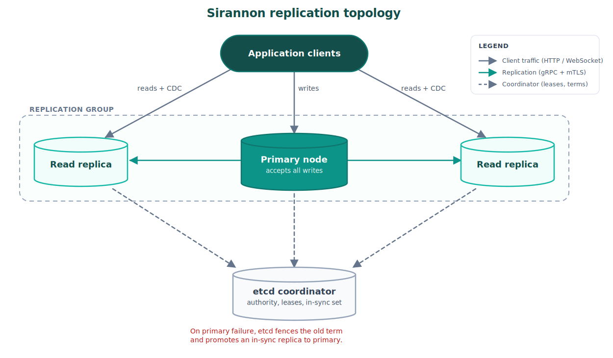

# sirannon-db

[](https://github.com/assetcorp/sirannon-db/actions/workflows/ci.yml)
[](https://www.npmjs.com/package/@delali/sirannon-db)
[](https://www.npmjs.com/package/@delali/sirannon-db)
[](https://www.npmjs.com/package/@delali/sirannon-db)
[](https://github.com/assetcorp/sirannon-db/blob/main/LICENSE)

Build a networked SQLite service with connection pooling, change data capture, migrations, backups, and a client SDK. Applications reach Sirannon over HTTP or WebSocket, while Sirannon nodes replicate primary-owned changes over gRPC. Coordinator mode adds etcd-backed authority and automatic failover.

The benchmarks compare Sirannon against Postgres 17 on the same OLTP workloads, driving each engine through the client it provides and matching durability on both sides. Every published figure is generated from a recorded run on a disclosed machine, and the page shows where each engine wins. See the full [methodology and results](../../BENCHMARKS.md).

See a three-node cluster keep serving through a primary failure in the [distributed entitlements example](https://github.com/assetcorp/sirannon-db/tree/main/packages/ts/examples/distributed-entitlements), which runs the etcd coordinator, gRPC replication with mutual TLS, and fault injection on your machine.

> *sirannon* means 'gate-stream' in Sindarin.

## Project status

Sirannon has two levels of maturity. The core data layer, the server, the client, and primary-replica replication are stable. Coordinator-backed automatic failover is the newest part and needs more production use before it is stable.

| Part | Status | Details |
| --- | --- | --- |
| Core engine (`@delali/sirannon-db`) | Stable | Queries, transactions, connection pooling, change data capture, migrations, backups, hooks, metrics, and multi-tenant lifecycle, covered by more than 130 test files with continuous integration on Node 22 and 24. |
| Server and client (`@delali/sirannon-db/server`, `@delali/sirannon-db/client`) | Stable | HTTP and WebSocket access with reconnection and subscription restore. The server runs client SQL by design, so read the [security section](#security) before you expose it. |
| Primary-replica replication (`@delali/sirannon-db/replication`) | Stable | Hybrid Logical Clock stamping, conflict resolvers, first sync, write concerns, and a gRPC transport with mutual TLS. |
| Coordinator-backed automatic failover (`@delali/sirannon-db/replication/coordinator/etcd`) | Experimental | etcd authority, primary terms, and in-sync sets, verified by a Docker conformance run under fault injection. It is new and not yet proven in production. |
| Drivers | Stable: better-sqlite3, Node, wa-sqlite. Experimental: Bun, Expo | The Bun and Expo drivers run today but have no TypeScript declarations yet. |

Durability follows SQLite's WAL mode with `synchronous=NORMAL` by default, and you can raise it. The [roadmap](https://github.com/assetcorp/sirannon-db/blob/main/ROADMAP.md) sets out what is next, including a second-language implementation and scaling beyond a single node's disk.

## Install

```bash
pnpm add -E @delali/sirannon-db
```

Then install the SQLite driver for your platform:

```bash
pnpm add -E better-sqlite3    # Node.js
pnpm add -E wa-sqlite          # Browser (IndexedDB persistence)
pnpm add -E expo-sqlite        # React Native (Expo)
# Node 22+ built-in sqlite and Bun need no extra package
```

## Quick start

### Node.js

```bash
pnpm add -E @delali/sirannon-db better-sqlite3
```

```ts
import { Sirannon } from '@delali/sirannon-db'
import { betterSqlite3 } from '@delali/sirannon-db/driver/better-sqlite3'

const driver = betterSqlite3()
const sirannon = new Sirannon({ driver })
const db = await sirannon.open('app', './data/app.db')

await db.execute('CREATE TABLE IF NOT EXISTS users (id INTEGER PRIMARY KEY, name TEXT, email TEXT)')
await db.execute('INSERT INTO users (name, email) VALUES (?, ?)', ['Ada', 'ada@example.com'])

const users = await db.query<{ id: number; name: string }>('SELECT * FROM users')
```

Node.js 22+ users can skip the extra dependency by using the built-in `node:sqlite` module. Node enables it by default from 22.13.0 and 23.4.0 onward; earlier 22.x releases need the `--experimental-sqlite` flag. The module is still experimental.

```ts
import { nodeSqlite } from '@delali/sirannon-db/driver/node'

const driver = nodeSqlite()
```

### Browser

```bash
pnpm add -E @delali/sirannon-db wa-sqlite
```

The browser driver persists data to IndexedDB through a WebAssembly SQLite build. Use `Database.create` directly since `Sirannon` registries are designed for server-side use.

```ts
import { Database } from '@delali/sirannon-db'
import { waSqlite } from '@delali/sirannon-db/driver/wa-sqlite'

const driver = waSqlite({ vfs: 'IDBBatchAtomicVFS' })
const db = await Database.create('app', '/app.db', driver, {
  readPoolSize: 1,
  walMode: false,
})

await db.execute('CREATE TABLE IF NOT EXISTS users (id INTEGER PRIMARY KEY, name TEXT, email TEXT)')
await db.execute('INSERT INTO users (name, email) VALUES (?, ?)', ['Ada', 'ada@example.com'])

const users = await db.query<{ id: number; name: string }>('SELECT * FROM users')
```

### React Native (Expo)

```bash
pnpm add -E @delali/sirannon-db expo-sqlite
```

```ts
import { Sirannon } from '@delali/sirannon-db'
import { expoSqlite } from '@delali/sirannon-db/driver/expo'

const driver = expoSqlite()
const sirannon = new Sirannon({ driver })
const db = await sirannon.open('app', 'app.db', {
  readPoolSize: 1,
})

await db.execute('CREATE TABLE IF NOT EXISTS users (id INTEGER PRIMARY KEY, name TEXT, email TEXT)')
await db.execute('INSERT INTO users (name, email) VALUES (?, ?)', ['Ada', 'ada@example.com'])

const users = await db.query<{ id: number; name: string }>('SELECT * FROM users')
```

### Bun

You need no extra dependency, because Bun includes `bun:sqlite`.

```ts
import { Sirannon } from '@delali/sirannon-db'
import { bunSqlite } from '@delali/sirannon-db/driver/bun'

const driver = bunSqlite()
const sirannon = new Sirannon({ driver })
const db = await sirannon.open('app', './data/app.db')
```

### Standalone databases

You can create databases without a `Sirannon` registry on any platform:

```ts
const db = await Database.create('app', './data/app.db', driver)
```

## Pluggable drivers

Sirannon-db separates the database engine from the library. You pick the driver that fits your runtime, and the rest of the API stays the same.

| Driver | Import | Runtime | Install |
| --- | --- | --- | --- |
| better-sqlite3 | `@delali/sirannon-db/driver/better-sqlite3` | Node.js | `pnpm add -E better-sqlite3` |
| Node built-in | `@delali/sirannon-db/driver/node` | Node.js >= 22 | None (built in; flag-free from Node 22.13.0 and 23.4.0) |
| wa-sqlite | `@delali/sirannon-db/driver/wa-sqlite` | Browser | `pnpm add -E wa-sqlite` |
| Bun | `@delali/sirannon-db/driver/bun` | Bun | None (uses `bun:sqlite`) |
| Expo | `@delali/sirannon-db/driver/expo` | React Native | `pnpm add -E expo-sqlite` |

```ts
import { betterSqlite3 } from '@delali/sirannon-db/driver/better-sqlite3'
const driver = betterSqlite3()

// or for Node 22's built-in sqlite:
import { nodeSqlite } from '@delali/sirannon-db/driver/node'
const driver = nodeSqlite()

// or for browser with IndexedDB persistence:
import { waSqlite } from '@delali/sirannon-db/driver/wa-sqlite'
const driver = waSqlite({ vfs: 'IDBBatchAtomicVFS' })
```

## Package exports

The package provides independent exports so you only bundle what you need:

| Import | What you get |
| --- | --- |
| `@delali/sirannon-db` | Core library: queries, transactions, CDC, migrations, backups, hooks, metrics, lifecycle |
| `@delali/sirannon-db/driver/*` | SQLite driver adapters (see table above) |
| `@delali/sirannon-db/file-migrations` | Load `.up.sql` / `.down.sql` files from a directory |
| `@delali/sirannon-db/backup-scheduler` | Cron-scheduled backup runner with file rotation, also re-exported from the core entry |
| `@delali/sirannon-db/server` | HTTP + WebSocket server powered by uWebSockets.js |
| `@delali/sirannon-db/client` | Browser/Node.js client SDK with auto-reconnect and subscription restore |
| `@delali/sirannon-db/replication` | Replication engine, conflict resolvers, topologies, HLC |
| `@delali/sirannon-db/replication/coordinator/etcd` | etcd-backed cluster coordinator for primary authority and automatic failover |
| `@delali/sirannon-db/transport/grpc` | gRPC replication transport with TLS support |
| `@delali/sirannon-db/transport/memory` | In-memory transport for testing |

## Core features

### Queries and transactions

```ts
const row = await db.queryOne<{ count: number }>('SELECT count(*) as count FROM users')

const result = await db.execute(
  'INSERT INTO users (name, email) VALUES (?, ?)',
  ['Grace', 'grace@example.com'],
)
// result.changes === 1, result.lastInsertRowId === 2

await db.executeBatch('INSERT INTO tags (label) VALUES (?)', [
  ['typescript'],
  ['sqlite'],
  ['realtime'],
])

const total = await db.transaction(async tx => {
  await tx.execute('UPDATE accounts SET balance = balance - 100 WHERE id = ?', [1])
  await tx.execute('UPDATE accounts SET balance = balance + 100 WHERE id = ?', [2])
  const [row] = await tx.query<{ balance: number }>('SELECT balance FROM accounts WHERE id = ?', [2])
  return row
})
```

### Bulk load

Loading a large dataset through many small committed transactions is slow and can stall the whole server. At `synchronous = full`, every commit calls `fsync`, and because the engine is synchronous, each `fsync` blocks the event loop until the disk confirms; tens of thousands of blocking `fsync` calls back to back stop the server from answering anything. `db.bulkLoad` runs the whole batch in one transaction under a relaxed durability level, then restores the configured level before it resolves.

```ts
const summary = await db.bulkLoad(
  'INSERT INTO events (id, payload) VALUES (?, ?)',
  rows, // an array of parameter arrays, one per row
  { durability: 'off' },
)
// summary.rowsLoaded, summary.changes
```

The load holds the single writer for its whole duration, so no other write commits under the relaxed level and no two loads race on the durability setting. On success the WAL is checkpointed at the restored level, so the loaded rows are written into the main database file before the call resolves. That checkpoint runs synchronously and blocks the event loop for the length of the WAL flush, which grows with the size of the load.

`durability` defaults to `'off'`. SQLite sanctions `'off'` for a load that starts from an empty database and that the operator can re-run after a power loss; a crash during an `'off'` load can corrupt the file, so recovery means re-running the load from scratch. Use `'normal'` for a load into a database that already holds data you cannot afford to lose, because it keeps WAL corruption safety while it still drops the per-commit `fsync`. Either way the configured `synchronous` level is restored when the load finishes, and a crash mid-load leaves the configured level in force on the next open, because `PRAGMA synchronous` is connection state that SQLite never stores in the database file.

The result sums the row count and the changes rather than returning one object per row, so a load of millions of rows never holds millions of result objects in memory. Over the server, one load must fit under `maxBodyBytes`; send a larger dataset as several sequential loads, each of which restores durability on its own.

### Connection pooling

Every database opens with 1 dedicated write connection and N read connections (default 4). WAL mode is enabled by default, allowing concurrent reads during writes.

```ts
const db = await sirannon.open('analytics', './data/analytics.db', {
  readPoolSize: 8,
  walMode: true,
})
```

### Change data capture (CDC)

Watch tables for INSERT, UPDATE, and DELETE events in real time. The CDC system installs SQLite triggers that record changes into a tracking table, then polls at a configurable interval.

```ts
await db.watch('orders')

const subscription = db
  .on('orders')
  .filter({ status: 'shipped' })
  .subscribe(event => {
    // event.type: 'insert' | 'update' | 'delete'
    // event.row: the current row
    // event.oldRow: previous row (updates and deletes)
    // event.seq: monotonic sequence number
    console.log(`Order ${event.row.id} was ${event.type}d`)
  })

// Stop listening:
subscription.unsubscribe()

// Stop tracking entirely:
await db.unwatch('orders')
```

### Migrations

Place numbered SQL files in a directory using the `.up.sql` / `.down.sql` convention. Each migration runs inside a transaction and is tracked in a `_sirannon_migrations` table so it only applies once. Down files are optional; rollback throws if a down file is missing for a version being rolled back.

```txt
migrations/
  001_create_users.up.sql
  001_create_users.down.sql
  002_add_email_index.up.sql
  003_create_orders.up.sql
  003_create_orders.down.sql
```

Timestamp-based versioning works the same way:

```txt
migrations/
  1709312400_create_users.up.sql
  1709312400_create_users.down.sql
```

#### File-based migrations

```ts
import { loadMigrations } from '@delali/sirannon-db/file-migrations'

const migrations = loadMigrations('./migrations')
const result = await db.migrate(migrations)
// result.applied: entries that ran this time
// result.skipped: number of entries already applied
```

#### Rollback

```ts
const migrations = loadMigrations('./migrations')
await db.rollback(migrations)            // undo the last applied migration
await db.rollback(migrations, 2)         // undo all migrations after version 2
await db.rollback(migrations, 0)         // undo everything
```

#### Programmatic migrations

Pass an array of migration objects instead of loading from files:

```ts
const migrations = [
  {
    version: 1,
    name: 'create_users',
    up: 'CREATE TABLE users (id INTEGER PRIMARY KEY, name TEXT)',
    down: 'DROP TABLE users',
  },
]

await db.migrate(migrations)
await db.rollback(migrations)        // undo last migration
await db.rollback(migrations, 0)     // undo everything
```

### Backups

One-shot backups use `VACUUM INTO` for a consistent snapshot. Scheduled backups run on a cron expression with automatic file rotation.

```ts
await db.backup('./backups/snapshot.db')

db.scheduleBackup({
  cron: '0 */6 * * *',      // every 6 hours
  destDir: './backups',
  maxFiles: 10,              // keep the 10 most recent
  timezone: 'America/New_York', // optional; defaults to the host timezone
  onError: err => console.error('Backup failed:', err),
})
```

The cron expression supports five or six fields (an optional leading seconds field), ranges, steps, lists, month and weekday names, and `@daily`-style nicknames. It runs in `timezone` when you set one, and in the host's local timezone otherwise. When the clocks go forward for daylight saving time, the scheduler skips the missing hour; when they go back, it runs a backup timed for the repeated hour once. The scheduler does not backfill: if the host sleeps or the clock jumps forward past a scheduled time, that run is skipped rather than run late, and a backward clock step repeats nothing.

### Hooks

Hooks run before or after key operations. Throwing from a before-hook denies the operation.

```ts
sirannon.onBeforeQuery(ctx => {
  if (ctx.sql.includes('DROP')) {
    throw new Error('DROP statements are not allowed')
  }
})

sirannon.onAfterQuery(ctx => {
  console.log(`[${ctx.databaseId}] ${ctx.sql} took ${ctx.durationMs}ms`)
})

sirannon.onDatabaseOpen(ctx => {
  console.log(`Opened ${ctx.databaseId} at ${ctx.path}`)
})
```

Global hooks on the `Sirannon` instance: `onBeforeQuery`, `onAfterQuery`, `onBeforeConnect`, `onDatabaseOpen`, `onDatabaseClose`. The `onBeforeSubscribe` hook is available through the `HookConfig` constructor option. Query hooks (`onBeforeQuery`, `onAfterQuery`) can also be registered locally on individual `Database` instances.

**Note:** The `ctx.sql.includes('DROP')` pattern shown above is for illustration only. Simple string matching is not a production SQL firewall because casing, comments, Unicode tricks, and concatenated SQL can bypass it. For real access control, combine `onBeforeQuery` with an allow-list of query patterns or a proper SQL parser.

### Metrics

Plug in callbacks to collect query timing, connection events, and CDC activity.

```ts
const sirannon = new Sirannon({
  driver,
  metrics: {
    onQueryComplete: m => histogram.observe(m.durationMs),
    onConnectionOpen: m => gauge.inc({ db: m.databaseId }),
    onConnectionClose: m => gauge.dec({ db: m.databaseId }),
    onCDCEvent: m => counter.inc({ table: m.table, op: m.operation }),
  },
})
```

### Lifecycle management

For multi-tenant setups, the lifecycle manager handles auto-opening, idle timeouts, and LRU eviction so you don't have to manage database handles yourself.

```ts
const sirannon = new Sirannon({
  driver,
  lifecycle: {
    autoOpen: {
      resolver: id => ({ path: `/data/tenants/${id}.db` }),
    },
    idleTimeout: 300_000, // close after 5 minutes of inactivity
    maxOpen: 50,          // evict least-recently-used when full
  },
})

// Databases resolve on first access:
const db = await sirannon.resolve('tenant-42') // opens /data/tenants/tenant-42.db
```

## Server

Expose any `Sirannon` instance over HTTP and WebSocket with a single function call. The server uses uWebSockets.js for high throughput.

```ts
import { Sirannon } from '@delali/sirannon-db'
import { betterSqlite3 } from '@delali/sirannon-db/driver/better-sqlite3'
import { createServer } from '@delali/sirannon-db/server'

const driver = betterSqlite3()
const sirannon = new Sirannon({ driver })
await sirannon.open('app', './data/app.db')

const server = createServer(sirannon, { port: 9876 })
await server.listen()
```

See the [Security](#security) section for authentication, TLS, and CORS configuration.

The server offers three write shapes, on both transports. Reach for each one when:

- **transaction** runs several *different* statements that must all succeed or all fail together, such as a debit on one row and a credit on another.
- **batch** runs *one* statement many times with different values, such as inserting a thousand rows into the same table. It costs less than a transaction of a thousand near-identical statements, and it stays all-or-nothing.
- **load** runs a batch for a large, from-scratch import. It relaxes durability while the rows go in and restores it afterward, so it trades power-loss safety during the load for speed; if the process dies mid-load, you re-run it.

### HTTP routes

| Method | Path | Description |
| --- | --- | --- |
| `POST` | `/db/:id/query` | Execute a SELECT, returns `{ rows }` |
| `POST` | `/db/:id/execute` | Execute a mutation, returns `{ changes, lastInsertRowId }` |
| `POST` | `/db/:id/transaction` | Execute many statements atomically in one transaction, returns `{ results }` |
| `POST` | `/db/:id/batch` | Apply one statement over many parameter sets in one transaction, returns `{ results }` |
| `POST` | `/db/:id/load` | Bulk-load rows with relaxed durability, returns `{ rowsLoaded, changes }` |
| `GET` | `/health` | Liveness check |
| `GET` | `/health/ready` | Readiness check with per-database status |

### WebSocket protocol

Connect to `ws://host:port/db/:id` and send JSON messages. Every message carries a `type` and a client-chosen `id`, and every reply echoes that `id`. The server dispatches CDC change events to subscribers in real time.

| Inbound `type` | Fields | Reply |
| --- | --- | --- |
| `query` | `sql`, `params?` | `{ type: 'result', data: { rows } }` |
| `execute` | `sql`, `params?` | `{ type: 'result', data: { changes, lastInsertRowId } }` |
| `transaction` | `statements`, `writeConcern?` | `{ type: 'result', data: { results } }` |
| `batch` | `sql`, `paramsBatch`, `writeConcern?` | `{ type: 'result', data: { results } }` |
| `load` | `sql`, `paramsBatch`, `durability?` | `{ type: 'result', data: { rowsLoaded, changes } }` |
| `subscribe` | `table`, `filter?` | `{ type: 'subscribed' }` then `change` events |
| `unsubscribe` | - | `{ type: 'unsubscribed' }` |

The `transaction`, `batch`, and `load` messages run every statement server-side in one transaction and reply once. The server never holds the write lock across a network round-trip, so it does not accept an interactive transaction where the client sends `BEGIN`, then more statements, then `COMMIT` over separate messages; a single slow or dead client would otherwise freeze every write to the database.

## Client SDK

The client SDK mirrors the core `Database` API with async methods. It supports both HTTP and WebSocket transports, with automatic reconnection and subscription restoration on the WebSocket transport.

```ts
import { SirannonClient } from '@delali/sirannon-db/client'

const client = new SirannonClient('http://localhost:9876', {
  transport: 'websocket',
  autoReconnect: true,
  reconnectInterval: 1000,
})

const db = client.database('app')

const users = await db.query<{ id: number; name: string }>('SELECT * FROM users')

await db.execute('INSERT INTO users (name) VALUES (?)', ['Turing'])

const sub = db.subscribe('users', event => {
  console.log('User changed:', event)
})

// Cleanup:
sub.unsubscribe()
client.close()
```

Transactions use the HTTP transport:

```ts
const httpClient = new SirannonClient('http://localhost:9876', {
  transport: 'http',
})

const httpDb = httpClient.database('app')

await httpDb.transaction([
  { sql: 'UPDATE accounts SET balance = balance - 50 WHERE id = ?', params: [1] },
  { sql: 'UPDATE accounts SET balance = balance + 50 WHERE id = ?', params: [2] },
])

httpClient.close()
```

## Distributed replication

<p align="center">
  
</p>

Sirannon can replicate a SQLite database across multiple nodes with change propagation, new-node bootstrapping, write concerns, and coordinator-backed failover. The production path is primary-replica: one primary accepts writes, replicas serve reads and can forward writes, and coordinator mode manages authority when failover is enabled. When replication is not enabled, the replication engine does not run.

```ts
import { ReplicationEngine } from '@delali/sirannon-db/replication'
import { InMemoryTransport, MemoryBus } from '@delali/sirannon-db/transport/memory'
import { GrpcReplicationTransport } from '@delali/sirannon-db/transport/grpc'
```

### Client and replication transports

Sirannon has two transport interfaces with different responsibilities:

| Traffic | Interface | Built-in network transport |
| --- | --- | --- |
| Application queries, writes, and CDC subscriptions | Client `Transport` | HTTP or WebSocket |
| Change batches, acknowledgements, write forwarding, and first sync between Sirannon nodes | `ReplicationTransport` | gRPC |

`WebSocketTransport` conforms to the client `Transport` interface. It connects an application to the Sirannon server and does not conform to `ReplicationTransport`. Use `GrpcReplicationTransport` for production node-to-node replication, or `InMemoryTransport` for tests and single-process scenarios.

### Primary-replica setup

One node accepts writes and pushes changes to read replicas. Replicas forward writes to the primary when `writeForwarding` is enabled.

```ts
import { ReplicationEngine, PrimaryReplicaTopology } from '@delali/sirannon-db/replication'
import { GrpcReplicationTransport } from '@delali/sirannon-db/transport/grpc'

const transport = new GrpcReplicationTransport({
  host: '0.0.0.0',
  port: 4200,
  tlsCert: './certs/primary.crt',
  tlsKey: './certs/primary.key',
  tlsCaCert: './certs/ca.crt',
})

const engine = new ReplicationEngine(db, writerConn, {
  nodeId: 'primary-us-east-1',
  topology: new PrimaryReplicaTopology('primary'),
  transport,
  snapshotConnectionFactory: () => driver.open(dbPath, { readonly: true }),
  changeTracker: tracker,
})

await engine.start()

await engine.execute('INSERT INTO orders (id, total) VALUES (?, ?)', [1, 4999])

const rows = await engine.query<{ id: number }>('SELECT * FROM orders')
```

On the replica side:

```ts
const replicaEngine = new ReplicationEngine(replicaDb, replicaConn, {
  nodeId: 'replica-eu-west-1',
  topology: new PrimaryReplicaTopology('replica'),
  transport: replicaTransport,
  transportConfig: { endpoints: ['primary.example.com:4200'] },
  writeForwarding: true,
  changeTracker: replicaTracker,
})

await replicaEngine.start()
```

When `initialSync` is `true` (the default), a new replica automatically pulls a full snapshot from the primary before accepting reads. The replica blocks reads and writes until the sync completes and incremental catch-up reaches the configured lag threshold.

### Coordinator-backed failover

Coordinator mode stores primary authority, node sessions, replication-group state, and the in-sync set in a `ClusterCoordinator`. The TypeScript package includes an etcd adapter:

```ts
import { readFileSync } from 'node:fs'
import { createEtcdCoordinator } from '@delali/sirannon-db/replication/coordinator/etcd'

const coordinator = createEtcdCoordinator({
  hosts: ['https://etcd-1.internal:2379', 'https://etcd-2.internal:2379'],
  keyPrefix: '/sirannon/orders',
  credentials: {
    rootCertificate: readFileSync('./certs/etcd-ca.crt'),
    privateKey: readFileSync('./certs/orders-node.key'),
    certChain: readFileSync('./certs/orders-node.crt'),
  },
})

const engine = new ReplicationEngine(db, writerConn, {
  nodeId: 'orders-node-a',
  topology: new PrimaryReplicaTopology('primary'),
  transport,
  transportConfig: {
    endpoints: ['orders-node-b.internal:4200', 'orders-node-c.internal:4200'],
    protocolVersion: '1',
  },
  changeTracker: tracker,
  snapshotConnectionFactory: () => driver.open(dbPath, { readonly: true }),
  writeForwarding: true,
  coordinator: {
    clusterId: 'commerce-production',
    groupId: 'orders',
    endpoint: 'https://orders-node-a.internal/db/orders',
    coordinator,
    votingDataBearingNodeIds: ['orders-node-a', 'orders-node-b', 'orders-node-c'],
    controller: true,
  },
})
```

Every coordinator-mode node needs a stable, persisted `nodeId`. `votingDataBearingNodeIds` creates the replication group when it does not exist; later nodes read the registered group from etcd. Production coordinator access requires HTTPS plus an authenticated identity. The in-memory coordinator and `allowInsecure: true` are for tests and local development.

Automatic write failover needs at least three voting data-bearing nodes. With fewer than three voters, the controller cannot prove majority authority after losing a node and keeps writes unavailable.

### Conflict resolution

Normal writes are serialised through one primary per replication group. When a receiver applies a batch and finds the target row already present, it passes the local and incoming versions to the configured resolver. This is part of normal batch application, not a separate repair command.

The replication module includes three built-in strategies:

| Strategy | Class | Behaviour |
| --- | --- | --- |
| Last-Writer-Wins | `LWWResolver` | Selects the change with the higher HLC timestamp. Ties break by node ID. |
| Field-Level Merge | `FieldMergeResolver` | Merges non-overlapping columns and uses per-column HLC metadata for overlapping columns. Falls back to whole-row LWW when column metadata is unavailable. |
| Primary Wins | `PrimaryWinsResolver` | Selects the version authored by a configured primary node ID. Falls back to LWW when neither version came from that node. |

Custom resolvers can be built by creating a class with a `resolve(ctx: ConflictContext): ConflictResolution` method.

Coordinator mode quarantines a returning former primary when it contains local-only writes. It does not merge that history into the current primary or expose a force-promotion or high-level repair API. An operator must rebuild, restore, or otherwise remediate the faulted node before rejoining it.

### First sync

When a new node joins a running cluster, it needs the full dataset before it can process incremental changes. The sync protocol handles this automatically:

1. The joiner connects and sends a sync request to the source
2. The source opens a consistent read-only snapshot and sends schema DDL (CREATE TABLE, CREATE INDEX)
3. The source streams table data in configurable batches (default 10,000 rows) with per-batch checksums
4. After all data is transferred, the source sends a manifest with row counts and primary-key hashes
5. The joiner verifies the manifest, transitions to catch-up mode, and applies incremental changes accumulated during the transfer
6. Once the replication lag drops below `maxSyncLagBeforeReady`, the joiner starts serving reads

The state machine is: `pending` -> `syncing` -> `catching-up` -> `ready`. You can monitor it via `engine.status().syncState`.

During `syncing`, `syncState.completedTables` lists the tables the joiner has finished and `syncState.totalTables` records how many it will receive in all, so `completedTables.length / totalTables` gives you first-sync progress. A source that predates this field leaves `totalTables` at 0 until the sync finishes.

For large databases where a network transfer is impractical, the out-of-band path lets you copy the SQLite file directly and start from a known sequence:

```ts
const engine = new ReplicationEngine(db, writerConn, {
  initialSync: false,
  resumeFromSeq: 50000n,
  // ...
})
```

### Write concerns

Control how many replicas must acknowledge a write before it returns:

```ts
await engine.execute(
  'INSERT INTO orders (id, total) VALUES (?, ?)',
  [1, 4999],
  { writeConcern: { level: 'majority', timeoutMs: 5000 } },
)
```

In static mode, omitting `writeConcern` returns after the local commit. In coordinator mode, omitting it selects `'majority'`. You can request `'local'`, `'majority'`, or `'all'` explicitly. A coordinator-mode `'local'` write is not protected against loss during automatic failover.

In coordinator mode, `majority` is calculated from configured voting data-bearing nodes in the replication group, including the primary's local durable commit. It is not calculated from the peers currently connected to this process. A successful coordinator-mode `majority` write survives automatic primary failover when only the failed primary is lost and an eligible in-sync replica remains.

### Replication FAQ

#### Is this SQLite over a shared network file system?

No. Each node has its own SQLite database file. Sirannon moves change batches through its replication transport and exposes database operations through the server and client layers. It does not rely on many machines opening the same SQLite file over NFS or another shared network file system.

#### What is replicated?

Sirannon replicates checksummed batches of `ReplicationChange` records. Each change includes the table, operation, row ID, primary key, HLC timestamp, transaction ID, node ID, old data, new data, and an optional DDL statement.

#### Is the protocol row-based, statement-based, operation-log based, or CRDT-like?

It is operation-log based at the Sirannon layer. Data changes include row images and primary-key metadata. DDL changes include a validated DDL statement. The current production write path is not CRDT-like; it prevents normal write conflicts with a single writable primary.

#### What ordering model does it use?

Each change includes a Hybrid Logical Clock timestamp. The HLC gives deterministic causal ordering across nodes without relying on perfectly synchronised wall clocks. Batches also include a sequence range, checksum, and, in coordinator mode, `groupId` and `primaryTerm`.

#### What happens under partitions?

Static mode has no automatic failover. If the static primary is lost, writes stay unavailable until an operator or external system promotes another node and reroutes clients.

Coordinator mode uses a cluster coordinator, primary terms, leases, in-sync sets, and fail-closed write behaviour. A primary may accept writes only while it can prove current authority. Replicas reject stale batches, stale sync messages, and stale forwarded writes. Only an in-sync replica can be promoted.

#### What topology do I need for automatic write failover?

Use at least three voting data-bearing Sirannon nodes in one replication group. One node has no failover. Two nodes can replicate, but one survivor cannot prove majority authority after the other node is lost.

#### Does Sirannon support schema changes across replicas?

Yes, with a safety allowlist. Replicated DDL supports `CREATE TABLE`, `ALTER TABLE ... ADD COLUMN`, `DROP TABLE`, `CREATE INDEX`, and `DROP INDEX`. The receiver rejects multiple statements, `AS SELECT`, extension loading, `ATTACH`, dangerous file functions, and DDL outside the allowlist.

#### How do foreign keys and unique constraints behave?

SQLite enforces constraints on each node. The primary serialises normal writes, which prevents normal concurrent unique-key conflicts. First sync orders tables by foreign-key dependency, and controlled resync disables foreign keys only while wiping tables before reloading from the sync source. Incoming replicated data still has to satisfy the receiving database's constraints.

#### Are reads consistent after writes?

Read concern controls this. `local` reads the selected node's local state. `majority` reads data that has reached the replication group's majority commit point. `linearizable` reads from the current primary after it proves live authority for the current primary term. If the requested read concern cannot be satisfied, the read fails rather than returning a weaker result.

#### Is this local-first or multi-writer today?

The current production path is primary-replica. Conflict resolvers determine how a receiving node applies a change to an existing row; they do not provide local-first reconciliation or a multi-writer CRDT layer.

### Transport options

| Transport | Import | Use case |
| --- | --- | --- |
| gRPC | `@delali/sirannon-db/transport/grpc` | Production Node.js multi-node replication over the network with TLS support. |
| In-Memory | `@delali/sirannon-db/transport/memory` | Testing and single-process multi-node scenarios. Messages delivered via microtask scheduling. |
| Custom | Build your own | Any transport that satisfies the `ReplicationTransport` interface (Redis, NATS, MQTT, TCP, etc). |

`ReplicationEngine.start()` derives `TransportConfig.localRole` from `topology.role`. In coordinator mode, it also supplies the current `groupId`, `primaryTerm`, and protocol version to the transport. Set these fields yourself only when you connect a `ReplicationTransport` without `ReplicationEngine`.

`TransportConfig` accepts these fields:

| Option | Type | Description |
| --- | --- | --- |
| `endpoints` | `string[]` | Peer addresses used to establish replication connections |
| `localRole` | `'primary' \| 'replica'` | Local topology role; `ReplicationEngine` supplies this value |
| `groupId` | `string` | Replication group carried in coordinator-mode handshakes; the engine supplies it from coordinator configuration |
| `primaryTerm` | `bigint` | Current fencing term; the engine supplies it from coordinator state |
| `protocolVersion` | `string` | Replication protocol version advertised to peers |
| `metadata` | `Record<string, unknown>` | Optional custom transport metadata |

### Replication configuration reference

| Option | Type | Default | Description |
| --- | --- | --- | --- |
| `nodeId` | `string` | auto-generated in static mode | Unique node identifier. Coordinator mode requires a stable, persisted value. |
| `topology` | `Topology` | required | `PrimaryReplicaTopology` |
| `transport` | `ReplicationTransport` | required | Transport for inter-node communication |
| `transportConfig` | `TransportConfig` | `{}` | Peer endpoints and transport metadata. The engine supplies role and coordinator fencing fields when it starts. |
| `writeForwarding` | `boolean` | `false` | Forward writes from replicas to the primary |
| `defaultConflictResolver` | `ConflictResolver` | `LWWResolver` | Default conflict resolution strategy |
| `conflictResolvers` | `Record<string, ConflictResolver>` | - | Per-table conflict resolution overrides |
| `batchSize` | `number` | `100` | Changes per replication batch |
| `batchIntervalMs` | `number` | `100` | Sender loop interval in ms |
| `maxClockDriftMs` | `number` | `60000` | Maximum tolerated HLC drift before rejecting a batch |
| `maxPendingBatches` | `number` | `10` | In-flight batches per peer before backpressure |
| `maxBatchChanges` | `number` | `1000` | Maximum accepted changes in one inbound batch |
| `ackTimeoutMs` | `number` | `5000` | Replication batch ack timeout |
| `initialSync` | `boolean` | `true` | Pull a full snapshot when joining a cluster |
| `syncBatchSize` | `number` | `10000` | Rows per sync batch during first sync |
| `maxConcurrentSyncs` | `number` | `2` | Maximum simultaneous sync sessions on the source |
| `maxSyncDurationMs` | `number` | `1800000` | Source aborts sync after this duration (30 min) |
| `maxSyncLagBeforeReady` | `number` | `100` | Catch-up lag threshold (in sequences) to transition to ready |
| `syncAckTimeoutMs` | `number` | `30000` | Per-batch ack timeout during sync (30s) |
| `catchUpDeadlineMs` | `number` | `600000` | Max time in catch-up phase before transitioning to ready (10 min) |
| `resumeFromSeq` | `bigint` | - | Start replication from a specific sequence (out-of-band sync) |
| `snapshotConnectionFactory` | `() => Promise<SQLiteConnection>` | - | Factory for read-only connections used during sync serving |
| `changeTracker` | `ChangeTracker` | - | CDC trigger manager, required for first sync |
| `flowControl` | `{ maxLagSeconds?, onLagExceeded? }` | - | Replication lag monitoring callbacks |
| `onBeforeForwardedQuery` | `(sql, params?) => void` | - | Validation or authorisation hook called before the primary executes each forwarded statement |
| `coordinator` | `CoordinatorModeConfig` | - | Enables coordinator-backed authority and failover |
| `snapshotThreshold` | `number` | - | Reserved configuration field; the current engine does not read it |

### Coordinator configuration reference

| Option | Type | Default | Description |
| --- | --- | --- | --- |
| `clusterId` | `string` | required | Coordinator namespace for the Sirannon cluster |
| `groupId` | `string` | required | Replication group containing copies of one database |
| `endpoint` | `string` | - | Application endpoint advertised for client discovery |
| `votingDataBearingNodeIds` | `string[]` | - | Voter set used to create an unregistered group and calculate coordinator write concerns |
| `coordinator` | `ClusterCoordinator` | required | Coordinator adapter, such as the etcd adapter |
| `sessionTtlMs` | `number` | `10000` | Node-session lease lifetime |
| `controller` | `boolean \| CoordinatorControllerConfig` | enabled | Enables the controller loop or configures its lease holder, TTL, and tick interval |
| `compatibility` | `CoordinatorCompatibilityMetadata` | - | Package, specification, and protocol versions used for promotion compatibility checks |

`CoordinatorControllerConfig` accepts `enabled`, `holderId`, `leaseTtlMs`, and `tickIntervalMs`. The lease TTL defaults to 10,000 ms, and the controller tick interval defaults to 1,000 ms.

### Replication errors

| Error | Code | When |
| --- | --- | --- |
| `ReplicationError` | `REPLICATION_ERROR` | Base class for replication failures |
| `SyncError` | `SYNC_ERROR` | First sync failures (node not ready, timeout, integrity mismatch) |
| `ConflictError` | `CONFLICT_ERROR` | Unresolvable write conflict |
| `TransportError` | `TRANSPORT_ERROR` | Inter-node communication failure |
| `BatchValidationError` | `BATCH_VALIDATION_ERROR` | Checksum mismatch, clock drift, or oversized batch |
| `TopologyError` | `TOPOLOGY_ERROR` | Write on a read-only node without forwarding |
| `WriteConcernError` | `WRITE_CONCERN_ERROR` | Quorum not reached within timeout |

## Security

Sirannon-db gives you secure primitives, but the network server is intentionally low-level: it can execute SQL sent by a client. Treat the server like a database endpoint, not like a public application API, unless you add an explicit application security boundary around it.

### Built-in protections

- **Parameterised values** - Query and execute calls pass parameters through the driver layer. Keep user input in `params`; never concatenate user input into SQL strings.
- **Identifier validation** - CDC table and column names are validated against a strict allowlist regex (`/^[a-zA-Z_][a-zA-Z0-9_]*$/`) and escaped with double quotes.
- **Path traversal prevention** - Migration and backup paths reject null bytes, `..` segments, and control characters before filesystem access.
- **Request size limits** - HTTP bodies and WebSocket payloads are capped at 1 MB to reduce memory-exhaustion risk.
- **Error isolation** - Remote errors use a machine-readable code and message. Stack traces and internal details are not returned to clients.
- **Connection isolation** - Read and write operations use separate connection pools. Read-only databases enforce immutability at the connection level.

### Deployment boundary

For production, put Sirannon behind one of these boundaries:

- A server-side application layer that exposes domain actions, not arbitrary SQL.
- A private network boundary where only trusted services can reach the Sirannon server.
- A custom `resolveExecutionTarget` or hook layer that allows only specific statements, tenants, and tables.

Do not expose unrestricted `/db/:id/query`, `/db/:id/execute`, `/db/:id/transaction`, or `/db/:id` WebSocket routes directly to untrusted browsers.

### HTTP authentication

Use `onRequest` to authenticate HTTP database routes. The hook runs before database routes and can deny requests by returning `{ status, code, message }`. Health endpoints bypass this hook.

```ts
const server = createServer(sirannon, {
  port: 9876,
  onRequest: ({ headers }) => {
    if (headers.authorization !== `Bearer ${process.env.SIRANNON_API_TOKEN}`) {
      return { status: 401, code: 'UNAUTHORIZED', message: 'Invalid or missing token' }
    }
  },
})
```

Send HTTP credentials through `headers` on the client:

```ts
const client = new SirannonClient('https://db.example.com', {
  transport: 'http',
  headers: { Authorization: `Bearer ${token}` },
})
```

### WebSocket authentication

Browsers cannot attach arbitrary `Authorization` headers to `new WebSocket(...)`. For browser clients, authenticate the upgrade with a mechanism the browser can send, such as same-site cookies or a short-lived value in `Sec-WebSocket-Protocol`. Also validate the `Origin` header during the upgrade.

```ts
const expectedOrigin = 'https://app.example.com'
const expectedProtocol = process.env.SIRANNON_WS_PROTOCOL

const server = createServer(sirannon, {
  port: 9876,
  onRequest: ({ headers, method, path }) => {
    const isWebSocketUpgrade = method === 'GET' && path.startsWith('/db/')
    if (!isWebSocketUpgrade) {
      return undefined
    }

    if (headers.origin !== expectedOrigin) {
      return { status: 403, code: 'FORBIDDEN_ORIGIN', message: 'Forbidden origin' }
    }

    const protocols = (headers['sec-websocket-protocol'] ?? '').split(',').map(value => value.trim())
    if (!expectedProtocol || !protocols.includes(expectedProtocol)) {
      return { status: 401, code: 'UNAUTHORIZED', message: 'Invalid WebSocket credentials' }
    }
  },
})
```

Then pass the browser-compatible protocol through the client:

```ts
const client = new SirannonClient('https://db.example.com', {
  transport: 'websocket',
  webSocketProtocols: [wsProtocol],
})
```

Protocol values must be valid `Sec-WebSocket-Protocol` tokens. If you derive them from secrets or signed data, encode them with a URL-safe format and keep them short-lived.

### TLS and transport security

The built-in server binds plain HTTP and WebSocket. For any traffic outside a trusted local network, terminate TLS upstream with a reverse proxy, load balancer, or platform edge and use `https://` and `wss://` client URLs. Without TLS, credentials, SQL text, parameters, and CDC payloads are sent in cleartext.

### CORS and browser access

CORS is disabled by default. Enable it only if browser clients need direct HTTP access, and restrict origins to trusted domains:

```ts
const server = createServer(sirannon, {
  port: 9876,
  cors: {
    origin: ['https://app.example.com'],
  },
})
```

Passing `cors: true` allows all origins and should be limited to local development. CORS does not protect WebSocket upgrades; validate WebSocket `Origin` in `onRequest`.

### SQL access control

Authentication only identifies the caller. It does not make arbitrary SQL safe. For internet-facing systems, enforce one of these patterns:

- Prefer application endpoints that perform domain operations such as `createOrder`, `reserveInventory`, or `markPaid`.
- If clients must use the Sirannon data API, wrap the database with `resolveExecutionTarget` and allow only known SQL statements and parameter shapes.
- Use hooks for additional query checks, but do not rely on naive substring matching as a SQL firewall.
- Keep tenant identifiers and ownership rules on the server side.

### Secrets and logging

- Do not place long-lived secrets in browser-visible configuration such as Vite `VITE_*` variables.
- Prefer short-lived WebSocket credentials minted by your application server.
- Redact `Authorization`, cookies, and WebSocket auth protocol values from access logs.
- Avoid logging full SQL statements when they can contain sensitive data.

### Security checklist

- Bind the server to `127.0.0.1` or a private interface unless a proxy is enforcing TLS and access control.
- Use HTTPS/WSS for non-local traffic.
- Authenticate every HTTP database route and every WebSocket upgrade.
- Validate WebSocket `Origin` against an explicit allowlist.
- Keep SQL behind application actions or a strict allowlist.
- Keep user input in SQL parameters, not interpolated strings.
- Restrict CORS to known origins.
- Add rate limits, audit logs, and abuse monitoring at the application or edge layer for public deployments.

Further reading: [OWASP REST Security Cheat Sheet](https://cheatsheetseries.owasp.org/cheatsheets/REST_Security_Cheat_Sheet.html), [OWASP WebSocket Security Cheat Sheet](https://cheatsheetseries.owasp.org/cheatsheets/WebSocket_Security_Cheat_Sheet.html), and [MDN WebSocket constructor](https://developer.mozilla.org/en-US/docs/Web/API/WebSocket/WebSocket).

## Error handling

All errors extend `SirannonError` with a machine-readable `code` property:

| Error | Code | When |
| --- | --- | --- |
| `DatabaseNotFoundError` | `DATABASE_NOT_FOUND` | Database ID not in registry |
| `DatabaseAlreadyExistsError` | `DATABASE_ALREADY_EXISTS` | Duplicate database ID |
| `ReadOnlyError` | `READ_ONLY` | Write attempted on read-only database |
| `QueryError` | `QUERY_ERROR` | SQL execution failure |
| `TransactionError` | `TRANSACTION_ERROR` | Transaction commit/rollback failure |
| `MigrationError` | `MIGRATION_ERROR` | Migration step failure |
| `HookDeniedError` | `HOOK_DENIED` | Before-hook rejected the operation |
| `CDCError` | `CDC_ERROR` | Change tracking pipeline failure |
| `BackupError` | `BACKUP_ERROR` | Backup operation failure |
| `ConnectionPoolError` | `CONNECTION_POOL_ERROR` | Pool closed or misconfigured |
| `MaxDatabasesError` | `MAX_DATABASES` | Capacity limit reached |
| `ExtensionError` | `EXTENSION_ERROR` | SQLite extension load failure |

The server and the bulk-load path add a few more codes. `createServer` throws `SirannonError` with `INVALID_MAX_BODY_BYTES` when `maxBodyBytes` is not a positive integer. A bulk load throws `INVALID_DURABILITY` when `durability` is neither `'off'` nor `'normal'`, and `DURABILITY_RESTORE_FAILED` when the load committed but the writer connection failed before its durability could be restored; treat that last code as 'the load succeeded, do not re-run it'. Over the wire the server also returns `PAYLOAD_TOO_LARGE` when a request or message exceeds `maxBodyBytes`, and `BULK_LOAD_UNSUPPORTED` when the resolved execution target for a database does not implement bulk load.

```ts
import { QueryError } from '@delali/sirannon-db'

try {
  await db.execute('INSERT INTO users (id) VALUES (?)', [1])
} catch (err) {
  if (err instanceof QueryError) {
    console.error(`SQL failed [${err.code}]: ${err.message}`)
    console.error(`Statement: ${err.sql}`)
  }
}
```

## Configuration reference

### `SirannonOptions`

| Option | Type | Required | Description |
| --- | --- | --- | --- |
| `driver` | `SQLiteDriver` | Yes | The SQLite driver adapter to use |
| `hooks` | `HookConfig` | No | Before/after hooks for queries, connections, subscriptions |
| `metrics` | `MetricsConfig` | No | Callbacks for query timing, connection events, CDC activity |
| `lifecycle` | `LifecycleConfig` | No | Auto-open resolver, idle timeout, max open databases |

### `DatabaseOptions`

| Option | Type | Default | Description |
| --- | --- | --- | --- |
| `readOnly` | `boolean` | `false` | Open in read-only mode |
| `readPoolSize` | `number` | `4` | Number of read connections |
| `walMode` | `boolean` | `true` | Enable WAL mode |
| `synchronous` | `'off' \| 'normal' \| 'full' \| 'extra'` | `'normal'` | Writer durability (`PRAGMA synchronous`); this is the level a bulk load restores when it finishes |
| `cdcPollInterval` | `number` | `50` | CDC polling interval in ms |
| `cdcRetention` | `number` | `3_600_000` | CDC retention period in ms (1 hour) |

### `ServerOptions`

| Option | Type | Default | Description |
| --- | --- | --- | --- |
| `host` | `string` | `'127.0.0.1'` | Bind address |
| `port` | `number` | `9876` | Listen port |
| `cors` | `boolean \| CorsOptions` | `false` | CORS configuration |
| `maxBodyBytes` | `number` | `1_048_576` | Maximum HTTP request body and WebSocket message size in bytes; one value governs both transports, and it must be a positive integer |
| `onRequest` | `OnRequestHook` | - | Middleware hook for auth, rate limiting, and request validation |

### `ClientOptions`

| Option | Type | Default | Description |
| --- | --- | --- | --- |
| `transport` | `'websocket' \| 'http'` | `'websocket'` | Transport protocol |
| `headers` | `Record<string, string>` | - | Custom HTTP headers; browser WebSocket handshakes do not use this option |
| `webSocketProtocols` | `string \| string[]` | - | WebSocket subprotocols sent during the upgrade handshake |
| `autoReconnect` | `boolean` | `true` | Reconnect on WebSocket disconnect |
| `reconnectInterval` | `number` | `1000` | Reconnect delay in ms |

## Examples

Self-contained example projects live in [`examples/`](examples/) and cover the current Node.js, browser, client-server, and distributed paths:

| Example | Runtime | Driver | What it demonstrates |
| --- | --- | --- | --- |
| [`node`](examples/node/) | Node.js >= 22 | better-sqlite3 or built-in `node:sqlite` | All core features: schema, migrations, CRUD, transactions, CDC, connection pools, metrics, multi-tenant, hooks, backup, shutdown |
| [`web-wa-sqlite`](examples/web-wa-sqlite/) | Browser (Vite) | wa-sqlite + IndexedDB | CRUD, transactions, CDC subscriptions in the browser |
| [`web-client`](examples/web-client/) | Browser + Node.js | better-sqlite3 (server) | Client SDK connecting to a Sirannon server over HTTP and WebSocket |
| [`distributed-entitlements`](examples/distributed-entitlements/) | Node.js + browser | better-sqlite3 | Three-node coordinator-backed replication over gRPC with etcd authority, local mTLS certificates, and Toxiproxy failure controls |

### Running the examples

From the repository root:

```bash
pnpm install
pnpm --filter @delali/sirannon-db build
```

Then pick an example:

```bash
# Node.js with better-sqlite3, the default driver
cd packages/ts/examples/node
pnpm start

# Node.js with built-in sqlite
cd packages/ts/examples/node
pnpm run start:node-native

# Browser with wa-sqlite (opens Vite dev server)
cd packages/ts/examples/web-wa-sqlite
pnpm run dev

# Client-server (starts both Sirannon server and Vite client)
cd packages/ts/examples/web-client
pnpm run dev

# Distributed entitlements (starts the Docker cluster and dashboard)
cd packages/ts/examples/distributed-entitlements
pnpm run dev
```

## Benchmarks

The benchmark suite compares Sirannon against Postgres 17 on the same OLTP workloads, driving Sirannon over HTTP into its real server and Postgres over its socket, both in resource-capped containers at matched durability, under an open-loop load generator that corrects for coordinated omission. The harness is a Python project at the repository root under `benchmarks/server`. See [`BENCHMARKS.md`](../../BENCHMARKS.md) for the methodology and the latest results.

## Development

```bash
pnpm install
pnpm build
pnpm test
pnpm typecheck
pnpm lint
```

## License

Apache-2.0
